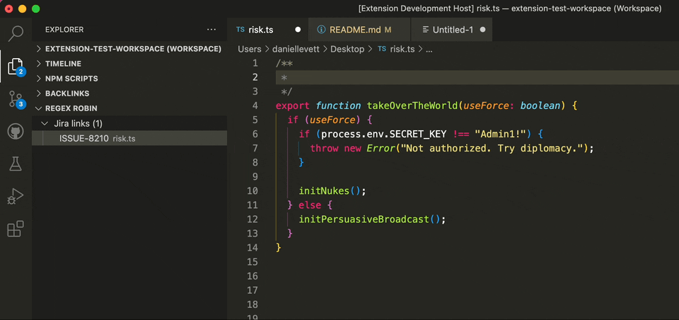

# Regex Robin

**Regex Robin** is a VS Code extension that automatically turns text into links based upon regex patterns.



## Configuration

Multiple patterns can be defined in your VS Code settings. The following examples highlight common use cases.

```jsonc
{
  "regexrobin.rules": [
    {
      "linkPattern": "ISSUE-\\d+",
      "linkTarget": "https://myorg.atlassian.net/browse/$0"
      // Example URL: https://myorg.atlassian.net/browse/ISSUE-299
    },
    {
      "linkPattern": "(FOO|BAR)-(\\d+)",
      "linkTarget": "https://example.com/$1/$2",
      // Example URL: https://example.com/FOO/123

      // Limit to specific languages
      "languages": ["plaintext", "markdown"]
    },
    {
      "linkPattern": "SKU([A-Z_]+)",
      "linkTarget": "https://shop.com?search=$1&min-price=\\$1"
      // Example URL: https://shop.com?search=PRODUCT_CODE&min-price=$1
      // Here, `\` is being used as an escape character to prevent substitution
      // of the second `$1`.
    }
  ]
}
```

### Rule precedence

### Styles

Styles are applied in the order they are defined. Styles can overlap.

With the example config below, the text "hello world" would have a red "hello" and a blue "world".

```json
{
  "regexrobin.rules": [
    {
      "regex": "hello world",
      "editor": [{ "color": "red" }]
    },
    {
      "regex": "world",
      "editor": [{ "color": "blue" }]
    }
  ]
}
```

If we reverse the order of these rules, then the entire text would be red.

### Links

When two link rules apply to the same text, the one defined last wins.

```json
{
  "regexrobin.rules": [
    // Match links like repo-name#22 to the relevant pull request
    {
      "regex": "([a-z_-]+)#(\\d+)",
      "regexFlags": { "ignoreCase": true },
      "editor": [{ "link": "https://github.com/myorg/$1/pull/$2" }]
    },
    // Match links like special-case#22 to the relevant pull request,
    // which is in a different github organisation, and has a long,
    // inconvenient name.
    {
      "regex": "special-case#(\\d+)",
      "editor": [
        {
          "link": "https://github.com/someorg/really-long-inconvenient-name/pull/$1"
        }
      ]
    }
  ]
}
```

The second rule is the one that would take effect for the text "special-case#22", despite the fact that the regex for both rules match the text.

<!-- This relies on potentially undocumented behaviour.

This extension does not enforce this logic, but instead relies on the fact that VS Code
just works like this by default. -->

## Limitations

If you have "Word wrap" enabled, any extra lines created by long text being wrapped will still be visible when using the `inlineReplacement` feature to replace it with something shorter, even if the replacement fits on one line.

## The logo

The logo was generated using [DALL·E 2](https://openai.com/dall-e-2/).

## Contributing

Read the [contributing doc](CONTRIBUTING.md) for direction around setting up the extension for development and debugging.
